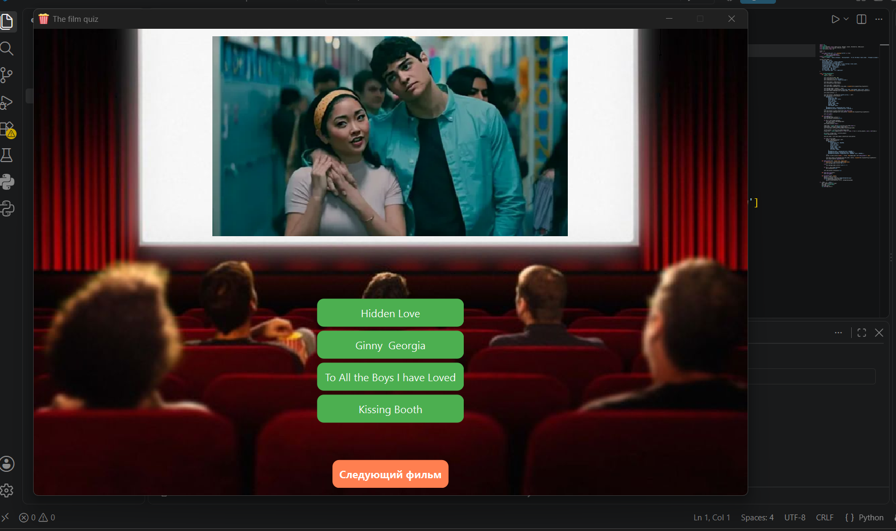
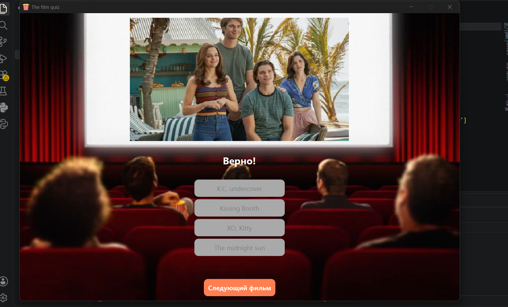
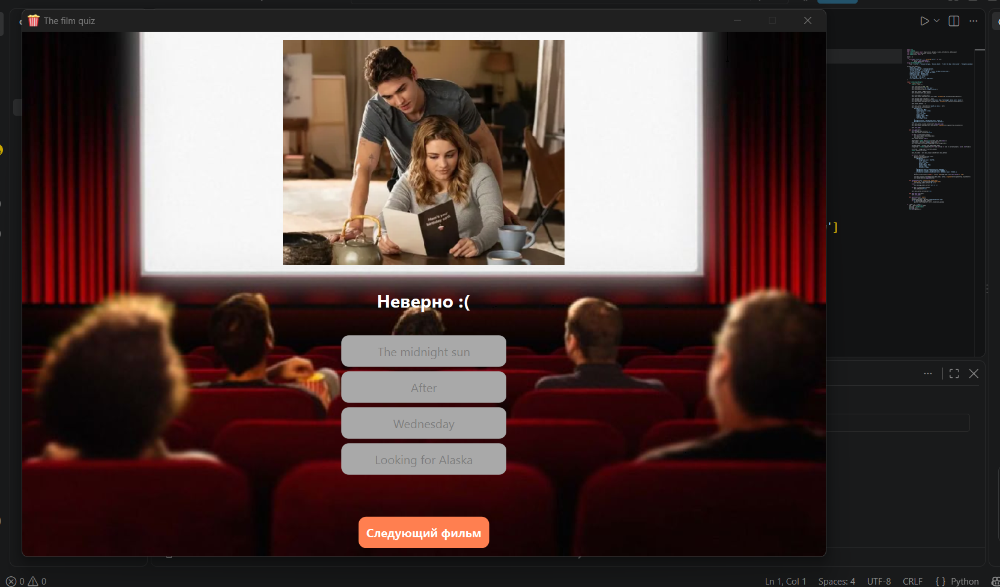

# Films-Quize

This project contains a Python script and game images. All images are linked directly within the code. I used a Python library PyQt6 to create this game.

# Install and Run
1. Ctrl + ' ` ' or Ctrl + ' ё '
2. In Terminal write: C:\Users\huawe\AppData\Local\Programs\Python\Python313\python.exe -m pip install PyQt6 --user
3. Then write: C:\Users\huawe\AppData\Local\Programs\Python\Python313\python.exe igame.py
4. Ready! Let`s play!

# Play
Look at the picture and choose the right option (name of the film).

You can check files to see how it works:

